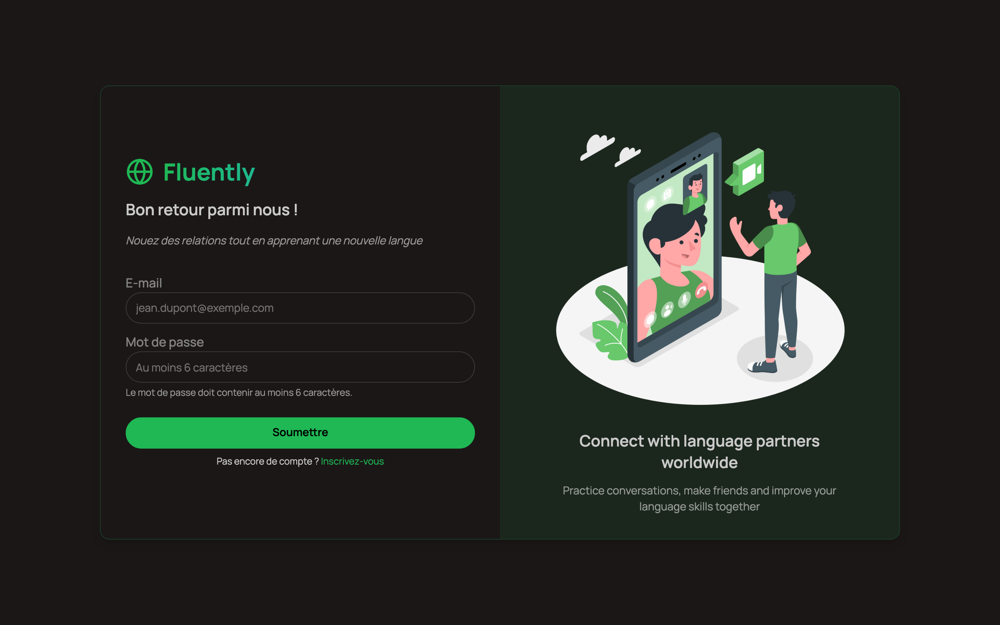
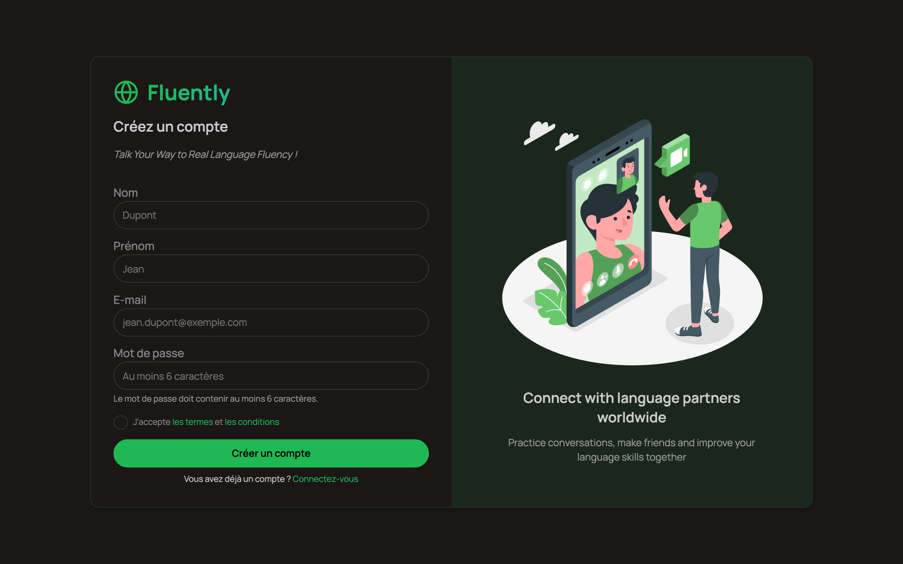

# Fluently

**Apprendre une langue en parlant à ceux qui la parlent.** Fluently met en relation des personnes qui apprennent la langue maternelle de l'autre, puis leur donne un chat et un appel vidéo pour pratiquer.

L'idée est simple : je parle français et j'apprends l'espagnol, tu parles espagnol et tu apprends le français — l'algorithme de recommandation nous met en relation, et on progresse tous les deux.

Application full-stack JavaScript — React + Express + PostgreSQL, avec chat et visio temps réel.

> **Démo en ligne** — l'instance de démonstration est actuellement hors ligne (l'hébergement de l'API a expiré). Le projet s'installe en local en quelques minutes, voir [Installation](#installation).

---

## Aperçu

| Connexion | Inscription |
|---|---|
|  |  |

---

## Fonctionnalités

| | |
|---|---|
| **Authentification** | Inscription, connexion, session par JWT en cookie `httpOnly`, mots de passe hachés avec bcrypt |
| **Onboarding** | Profil complet : langue maternelle, langue apprise, bio, localisation, photo |
| **Recommandations** | Suggestion de partenaires dont la langue maternelle correspond à la langue que l'utilisateur apprend |
| **Réseau social** | Demandes d'ami avec états `pending` / `accepted` / `rejected`, demandes reçues et envoyées, notifications |
| **Chat temps réel** | Messagerie 1-à-1 persistante, propulsée par Stream Chat |
| **Appel vidéo** | Visio avec caméra et micro, lancée depuis une conversation, lien d'appel partageable |
| **Thèmes** | 32 thèmes d'interface (DaisyUI), persistés côté client |
| **Langues** | 16 langues proposées, dont le **Moore** et la **Darija** |

## Stack technique

**Frontend** — React 19, Vite, React Router, TanStack Query (cache et invalidation des données serveur), Zustand (état UI local), Tailwind CSS + DaisyUI, Stream Chat & Video React SDK, axios, react-hot-toast.

**Backend** — Node.js, Express 5, PostgreSQL, Drizzle ORM (schéma typé + migrations versionnées), JWT, bcrypt, Stream Chat server SDK.

**Déploiement** — Frontend sur Vercel, API sur Railway, base PostgreSQL managée.

## Architecture

```
fluently/
├── backend/
│   └── src/
│       ├── Config/
│       │   ├── db/          # Connexion Drizzle, schéma, helpers
│       │   └── Stream/      # Client Stream serveur (upsert user, tokens)
│       ├── Controllers/     # auth · users · chat
│       ├── Middlewares/     # isAuthenticated, isOnboarded
│       ├── Routes/          # Déclaration des endpoints
│       ├── drizzle/         # 6 migrations SQL versionnées
│       └── app.js
└── frontend/
    └── src/
        ├── components/      # Auth · Chat · Form · Home · Layout · UI
        ├── pages/           # Login · SignUp · Onboarding · Home · Chat · Call · Notifications
        ├── hooks/           # useAuth
        ├── lib/             # Instance axios, couche d'appels API centralisée
        └── store/           # Store de thème (Zustand)
```

**Deux choix d'architecture qui structurent le projet :**

- **Les appels API sont centralisés dans `frontend/src/lib/api.js`**, avec un objet `API_PATHS` qui recense toutes les routes. Aucun composant ne construit d'URL : ajouter un endpoint se fait à un seul endroit, et les fonctions se branchent directement sur TanStack Query.
- **Le secret Stream ne quitte jamais le serveur.** Le frontend ne connaît que la clé publique ; il demande un token éphémère à `/api/chat/token`, généré côté backend pour l'utilisateur authentifié. C'est ce qui permet d'utiliser un service temps réel tiers sans exposer les identifiants du compte.

### Modèle de données

Deux tables, reliées par une relation d'amitié auto-référente sur `users` :

- `users` — identité, langues (maternelle / apprise), bio, localisation, photo, drapeau `is_onboarded`
- `friendships` — `user_id` → `friend_id`, statut (`pending` | `accepted` | `rejected`), horodatages, suppression en cascade

### API

| Méthode | Route | Description |
|---|---|---|
| `POST` | `/api/auth/register` | Inscription (authentifie immédiatement) |
| `POST` | `/api/auth/login` | Connexion |
| `POST` | `/api/auth/logout` | Déconnexion |
| `GET` | `/api/auth/getUser` | Utilisateur courant |
| `POST` | `/api/auth/onboard` | Complète le profil |
| `GET` | `/api/users/getRecommendedFriends` | Partenaires linguistiques suggérés |
| `POST` | `/api/users/sendFriendRequest` | Envoie une demande |
| `PUT` | `/api/users/acceptFriendRequest` | Accepte une demande |
| `GET` | `/api/users/myFriends` | Liste des amis |
| `GET` | `/api/users/getFriendRequests` | Demandes reçues |
| `GET` | `/api/users/getOutGoingFriendRequests` | Demandes envoyées |
| `GET` | `/api/chat/token` | Token Stream de l'utilisateur |

Toutes les routes hors authentification passent par `isAuthenticated`, et celles liées au réseau social par `isOnboarded`.

## Installation

**Prérequis** — Node.js 20+, une base PostgreSQL, un compte [Stream](https://getstream.io) (offre gratuite suffisante).

```bash
git clone https://github.com/hermeskongo/fluently.git
cd fluently
```

**1. Backend**

```bash
cd backend
npm install
cp .env.example .env      # puis renseigner DATABASE_URL, JWT_SECRET et les clés Stream
npm run generate          # génère les migrations Drizzle
npm run push              # applique le schéma à la base
npm run dev               # http://localhost:5001
```

**2. Frontend**

```bash
cd frontend
npm install
cp .env.example .env      # VITE_BACKEND_URL et VITE_STREAM_API_KEY
npm run dev               # http://localhost:5173
```

Les deux clés Stream proviennent du même dashboard : `STREAM_API_KEY` et `VITE_STREAM_API_KEY` ont la même valeur, `STREAM_API_SECRET` reste exclusivement côté backend.

## Pistes d'évolution

- Tests automatisés (aucun pour l'instant)
- Appels de groupe et salons thématiques par langue
- Correction et suggestions assistées pendant la conversation
- Indicateurs de progression et objectifs de pratique

---

Développé par **[Hermès KONGO](https://github.com/hermeskongo)**.
